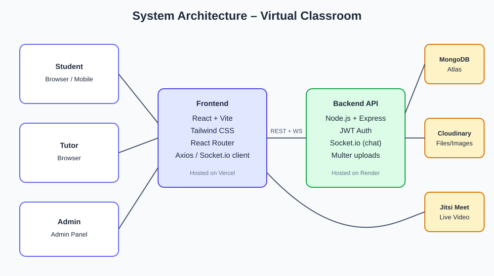

# EduConnect — Virtual Classroom & Online Tutoring

A full-stack (MERN) platform where **tutors** run classes, live video sessions and assignments, and **students** join classes, attend live, submit work, chat in real time and book 1-on-1 tutoring.



## Features

| Area | What it does |
|---|---|
| **Auth & roles** | JWT login/register, bcrypt-hashed passwords. Three roles: student, tutor, admin. |
| **Classes** | Tutors create classes and get a 6-character join code. Students join with the code. Tutors can edit or delete a class and remove students. |
| **Stream** | The tutor posts announcements, which appear live for every student. |
| **Study materials** | Upload files (PDF, DOCX, PPTX, video and more, up to 25 MB) or share links. |
| **Assignments** | Due dates, max marks, attachments. Students submit text and/or a file; late submissions are flagged automatically. Tutors see a submission list for the whole class, grade work and leave feedback. The student gets a live notification when graded. |
| **Live sessions** | Classes run on **Google Meet**. When scheduling, a tutor pastes a Meet link, or (after connecting Google) EduConnect creates one automatically through the Google Meet API. The session goes live once it has a link; the class room page opens Meet in a new tab and keeps the class chat alongside. Attendance is recorded. |
| **Real-time chat** | Each class has a Socket.io chat room, with "is typing…" indicators. |
| **1-on-1 tutoring** | Search tutors by subject, view profiles and reviews, request a session. The tutor accepts (adding a Google Meet link) or declines, then both join from the Bookings page. |
| **Ratings & reviews** | Students rate a tutor after a confirmed session. |
| **Dashboards** | Separate views for each role: upcoming sessions, work due, grades, items waiting to be graded. |
| **Admin panel** | Platform statistics; search, enable or disable users. |
| **Focus timer** | Pomodoro timer with focus and break modes, daily study goal, streaks, weekly chart and a task list. |
| **Calendar** | Month view of live sessions, assignment deadlines and 1-on-1 bookings. |
| **My Grades** | Average per class and overall, a letter grade, and the status of every assignment. |
| **Dark mode** | Light/dark theme toggle that is remembered between visits and follows the system setting by default. |
| **Notifications** | Bell menu that collects live notifications (grades, bookings). |

## Tech stack

- **Frontend:** React 18, Vite, Tailwind CSS v4, React Router, Axios, Socket.io client, lucide icons
- **Backend:** Node.js, Express, Mongoose, Socket.io, JWT, Multer, Helmet, rate limiting
- **Database:** MongoDB (Atlas or local). Without a configured database, an in-memory MongoDB with demo data is started automatically.
- **Video:** Google Meet (pasted links, or auto-created with the Google Meet REST API + OAuth 2.0)

## Getting started

Requires **Node.js 20+**.

```bash
npm run install:all     # installs root, server and client dependencies
npm run dev             # starts API (http://localhost:5000) + web app (http://localhost:5173)
```

Open http://localhost:5173 and use one of the demo accounts (password `password123`):

| Role | Email |
|---|---|
| Student | student@educonnect.dev |
| Tutor | tutor@educonnect.dev |
| Admin | admin@educonnect.dev |

> The first run downloads a MongoDB binary (~600 MB) for the in-memory database. In-memory data **resets on every restart**. Use a real database for anything persistent (see below).

### Using a real database (MongoDB Atlas)

1. Create a free cluster at https://www.mongodb.com/atlas and copy the connection string.
2. Edit `server/.env`:
   ```env
   MONGO_URI=mongodb+srv://<user>:<pass>@cluster0.xxxxx.mongodb.net/educonnect
   JWT_SECRET=<a long random string>
   ```
3. Optionally load demo data: `npm run seed --prefix server` (⚠ this wipes the database).

## Project structure

```
class-room/
├── client/                 React app
│   └── src/
│       ├── api/            axios instance + helpers
│       ├── context/        AuthContext, SocketContext
│       ├── components/     layout + reusable UI kit
│       ├── hooks/          useFetch
│       ├── pages/          route pages (class/ = class page tabs)
│       └── utils/          formatting helpers
├── server/                 Express API
│   └── src/
│       ├── config/         env + database connection
│       ├── models/         Mongoose schemas
│       ├── middleware/     auth, roles, uploads, errors
│       ├── controllers/    business logic
│       ├── routes/         REST route table
│       ├── utils/          ApiError, seed data
│       └── socket.js       real-time chat & notifications
└── design/                 architecture, DB and UI mockups
```

## API overview

All endpoints are prefixed with `/api`. Every endpoint except register/login requires `Authorization: Bearer <token>`.

| Method | Endpoint | Who |
|---|---|---|
| POST | `/auth/register`, `/auth/login` | public |
| GET/PATCH | `/auth/me` | any |
| GET | `/dashboard` | student, tutor |
| GET/POST | `/classes` | list mine / create (tutor) |
| POST | `/classes/join` | student |
| GET/PATCH/DELETE | `/classes/:id` | member / tutor |
| GET/POST/DELETE | `/classes/:id/announcements` | member / tutor |
| GET/POST/DELETE | `/classes/:id/materials` | member / tutor |
| GET/POST/PATCH/DELETE | `/classes/:id/sessions` | member / tutor |
| POST | `/classes/:id/sessions/:sid/join` | member |
| GET/POST/DELETE | `/classes/:id/assignments` | member / tutor |
| POST | `/classes/:id/assignments/:aid/submit` | student |
| PATCH | `/classes/:id/assignments/:aid/submissions/:sid` | tutor (grade) |
| GET | `/classes/:id/messages` | member |
| GET | `/tutors`, `/tutors/:id` | any |
| POST | `/tutors/:id/reviews` | student |
| GET/POST/PATCH | `/bookings`, `/bookings/:id/join` | student, tutor |
| GET/PATCH | `/admin/stats`, `/admin/users` | admin |

**Socket.io events:** `class:join`, `chat:send`, `chat:typing` → `chat:message`, `announcement:new`, `session:new`, `session:updated`, `notify`.

## Deployment

- **Backend → Render / Railway:** root `server`, start command `npm start`, set `MONGO_URI`, `JWT_SECRET`, `CLIENT_URL`, `NODE_ENV=production`.
- **Frontend → Vercel / Netlify:** root `client`, build `npm run build`, output `dist`, set `VITE_API_URL=https://your-api.onrender.com`. Add a SPA rewrite of all routes to `/index.html`.
- **Uploads:** files are stored on the server disk (`server/uploads`). On hosts with temporary disks (Render free tier), move them to Cloudinary or S3.
## Google Meet setup (optional, for automatic Meet links)

Pasting a Meet link works with no setup. Automatic links need Google sign-in (OAuth 2.0); an API key alone cannot create meetings.

1. In https://console.cloud.google.com create a project and enable the **Google Meet REST API**.
2. **APIs & Services → OAuth consent screen**: choose **External**, fill in the app name and support email, add the scope `https://www.googleapis.com/auth/meetings.space.created`, and add each tutor's Google account under **Test users** (up to 100 while the app is in *Testing*).
3. **APIs & Services → Credentials → Create credentials → OAuth client ID → Web application.** Under **Authorized redirect URIs** add:
   - `https://<your-site>.onrender.com/api/google/callback`
   - `http://localhost:5173/api/google/callback` (local development)
4. Set `GOOGLE_CLIENT_ID` and `GOOGLE_CLIENT_SECRET` (Render → Environment, or `server/.env`).
5. Tutors open **Profile → Google Meet → Connect Google**. The schedule and accept-booking forms then offer "Create the Meet link automatically".

Google Meet cannot be embedded inside another website, so meetings open in a new tab.

## Roadmap ideas

Quizzes with auto-grading · shared whiteboard · session recordings · payments for 1-on-1 sessions (Razorpay/Stripe) · email reminders · attendance reports export.
